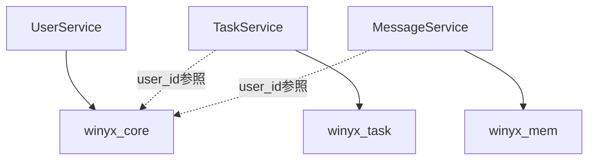

# マイクロサービス データベース設計戦略

> Winyxプロジェクトにおけるマイクロサービス間のデータベース設計とベストプラクティス

---

## 🏗️ データベース設計戦略

### 📊 **推奨アプローチ：ハイブリッド型**

```
┌─────────────────┐    ┌─────────────────┐    ┌─────────────────┐
│   winyx_core    │    │   winyx_task    │    │   winyx_mem     │
│   (共通・認証)   │    │  (タスク管理)    │    │ (メッセージ)     │
├─────────────────┤    ├─────────────────┤    ├─────────────────┤
│ ✓ users         │    │ • tasks         │    │ • messages      │
│ ✓ sessions      │    │ • task_assign   │    │ • channels      │
│ ✓ user_profiles │    │ • categories    │    │ • participants  │
│ • roles         │    │ • task_history  │    │ • attachments   │
│ • permissions   │    │ • comments      │    │ • message_read  │
└─────────────────┘    └─────────────────┘    └─────────────────┘
```

---

## 🎯 データベース分散戦略

### 1. **winyx_core（共通基盤）** ⭐
```sql
-- 既存テーブル（そのまま活用）
users (id, name, email, password, status, created_at, updated_at)
sessions (id, user_id, token, expires_at, created_at)  
user_profiles (id, user_id, avatar_url, bio, phone, address, birth_date, gender, occupation, website, social_links, preferences, created_at, updated_at)

-- 権限管理テーブル（新規追加）
roles (id, name, description, created_at, updated_at)
permissions (id, name, resource, action, description, created_at, updated_at)
user_roles (id, user_id, role_id, created_at)
role_permissions (id, role_id, permission_id, created_at)
```

**責任範囲：**
- ✅ ユーザー認証・認可
- ✅ セッション管理  
- ✅ プロフィール管理
- ✅ 権限・役割管理

### 2. **winyx_task（タスク管理専用）** 📋
```sql
CREATE DATABASE winyx_task;

-- タスク関連テーブル
tasks (
    id, user_id, title, description, status, priority, 
    due_date, created_at, updated_at
)

task_assignments (
    id, task_id, assigned_user_id, assigned_by, created_at
)

task_categories (
    id, name, color, description, created_at, updated_at
)

task_comments (
    id, task_id, user_id, content, created_at, updated_at
)

task_attachments (
    id, task_id, file_name, file_path, file_size, 
    mime_type, created_at
)

task_history (
    id, task_id, user_id, action, old_value, new_value, 
    created_at
)

task_labels (
    id, task_id, label_name, color, created_at
)

task_dependencies (
    id, task_id, depends_on_task_id, created_at
)
```

**責任範囲：**
- ✅ タスク作成・管理
- ✅ アサイン・スケジューリング
- ✅ コメント・添付ファイル
- ✅ 履歴・ラベル管理

### 3. **winyx_mem（メッセージ管理専用）** 💬
```sql
CREATE DATABASE winyx_mem;

-- メッセージ関連テーブル
channels (
    id, name, type, description, is_private, 
    created_by, created_at, updated_at
)

channel_participants (
    id, channel_id, user_id, role, joined_at, 
    last_read_at
)

messages (
    id, channel_id, user_id, content, message_type,
    reply_to_message_id, created_at, updated_at, deleted_at
)

message_attachments (
    id, message_id, file_name, file_path, file_size,
    mime_type, created_at
)

message_reactions (
    id, message_id, user_id, reaction_type, created_at
)

message_read_status (
    id, message_id, user_id, read_at
)

threads (
    id, parent_message_id, created_at, updated_at
)
```

**責任範囲：**
- ✅ チャンネル管理
- ✅ リアルタイムメッセージング
- ✅ ファイル共有
- ✅ リアクション・既読管理

---

## 🔄 マイクロサービス間のデータアクセスパターン

### パターン1: **Database per Service**


### パターン2: **Cross-Service API Call**
```typescript
// TaskServiceからUserServiceのAPI呼び出し
class TaskService {
  async getTaskWithUserInfo(taskId: string) {
    const task = await this.taskRepository.findById(taskId);
    
    // UserServiceのAPIを呼び出し
    const user = await this.userServiceClient.getUserById(task.user_id);
    
    return {
      ...task,
      user: user
    };
  }
}
```

### パターン3: **Event-Driven データ同期**
```typescript
// ユーザー情報変更時のイベント発行
class UserService {
  async updateUser(userId: string, data: UpdateUserData) {
    await this.userRepository.update(userId, data);
    
    // 他のサービスに通知
    await this.eventBus.publish('user.updated', {
      userId,
      name: data.name,
      email: data.email
    });
  }
}

// TaskServiceでユーザー情報の変更を受信
class TaskService {
  @EventHandler('user.updated')
  async handleUserUpdated(event: UserUpdatedEvent) {
    // 必要に応じてタスクの担当者情報をキャッシュ更新
    await this.updateUserCacheInfo(event.userId, event);
  }
}
```

---

## 📋 実装ガイドライン

### 1. **データベース接続設定**

#### UserService (winyx_core接続)
```yaml
# user_service/etc/user_service-api.yaml
Mysql:
  DataSource: "winyx_app:PASSWORD@tcp(127.0.0.1:3306)/winyx_core?charset=utf8mb4&parseTime=true"
```

#### TaskService (winyx_task接続)
```yaml  
# task_service/etc/task_service-api.yaml
Mysql:
  DataSource: "winyx_app:PASSWORD@tcp(127.0.0.1:3306)/winyx_task?charset=utf8mb4&parseTime=true"
```

#### MessageService (winyx_mem接続)
```yaml
# message_service/etc/message_service-api.yaml  
Mysql:
  DataSource: "winyx_app:PASSWORD@tcp(127.0.0.1:3306)/winyx_mem?charset=utf8mb4&parseTime=true"
```

### 2. **Cross-Service通信**

#### API Client設定
```go
// internal/clients/userserviceclient.go
type UserServiceClient struct {
    baseURL string
    client  *http.Client
}

func NewUserServiceClient(baseURL string) *UserServiceClient {
    return &UserServiceClient{
        baseURL: baseURL,
        client:  &http.Client{Timeout: 10 * time.Second},
    }
}

func (c *UserServiceClient) GetUser(ctx context.Context, userID int64) (*User, error) {
    url := fmt.Sprintf("%s/api/v1/users/%d", c.baseURL, userID)
    
    req, err := http.NewRequestWithContext(ctx, "GET", url, nil)
    if err != nil {
        return nil, err
    }
    
    resp, err := c.client.Do(req)
    if err != nil {
        return nil, err
    }
    defer resp.Body.Close()
    
    var user User
    if err := json.NewDecoder(resp.Body).Decode(&user); err != nil {
        return nil, err
    }
    
    return &user, nil
}
```

### 3. **データ整合性の保証**

#### Saga パターン実装例
```go
// タスク作成時のSagaパターン
type CreateTaskSaga struct {
    userService UserServiceClient
    taskRepo    TaskRepository
}

func (s *CreateTaskSaga) Execute(ctx context.Context, req CreateTaskRequest) error {
    // 1. ユーザー存在確認
    user, err := s.userService.GetUser(ctx, req.UserID)
    if err != nil {
        return fmt.Errorf("user validation failed: %w", err)
    }
    
    // 2. タスク作成
    task, err := s.taskRepo.Create(ctx, &Task{
        UserID:      req.UserID,
        Title:       req.Title,
        Description: req.Description,
        Status:      "todo",
    })
    if err != nil {
        return fmt.Errorf("task creation failed: %w", err)
    }
    
    // 3. 成功通知（イベント発行）
    s.eventBus.Publish("task.created", TaskCreatedEvent{
        TaskID: task.ID,
        UserID: user.ID,
        Title:  task.Title,
    })
    
    return nil
}
```

---

## 🛡️ セキュリティとパフォーマンス

### 1. **データベースセキュリティ**
- ✅ サービス毎に専用のDBユーザーを作成
- ✅ 最小権限の原則（必要なテーブルのみアクセス）
- ✅ 接続プールの最適化

### 2. **パフォーマンス最適化**
- ✅ サービス間通信のキャッシュ戦略
- ✅ N+1問題の回避
- ✅ バッチ処理によるデータ同期

### 3. **監視・ロギング**
```go
// 分散トレーシング用ログ
logx.Infow("Cross-service call",
    logx.Field("service", "TaskService"),
    logx.Field("target", "UserService"),
    logx.Field("user_id", userID),
    logx.Field("trace_id", traceID),
)
```

---

## 🚀 マイグレーション戦略

### フェーズ1: 基盤準備
1. 既存の`winyx_core`に権限管理テーブルを追加
2. UserServiceで既存テーブルを活用

### フェーズ2: 新サービス追加  
1. `winyx_task`データベース作成
2. TaskServiceの実装・デプロイ

### フェーズ3: 統合・最適化
1. `winyx_mem`データベース作成  
2. MessageServiceの実装・デプロイ
3. サービス間連携の最適化

---

## 📝 まとめ

### ✅ **採用する設計**
- **Database per Service** - 各マイクロサービスが独自のDBを持つ
- **既存winyx_coreの活用** - 認証基盤として共通利用
- **API-based通信** - サービス間のデータアクセス
- **イベント駆動** - データ同期とリアルタイム更新

### 🎯 **期待される効果**
- 🔧 **開発独立性** - 各チームが独立して開発可能
- 📈 **スケーラビリティ** - サービス毎の個別スケーリング
- 🛡️ **障害分離** - 一部サービスの障害が全体に影響しない
- 🚀 **技術選択の自由** - サービス毎に最適な技術スタックを選択

この設計により、Winyxプロジェクトは堅牢で拡張性の高いマイクロサービスアーキテクチャを実現できます。